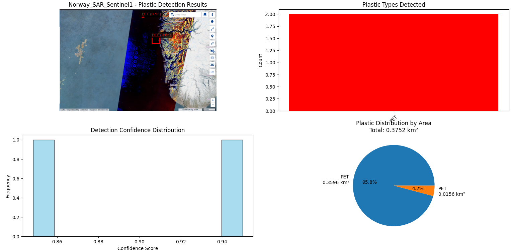
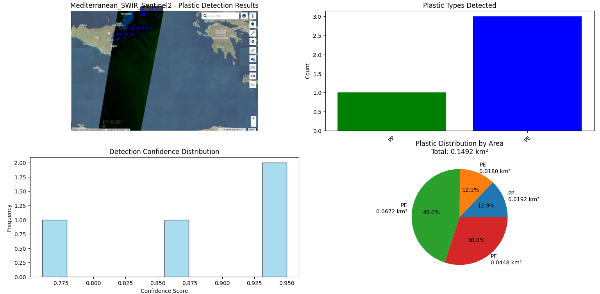
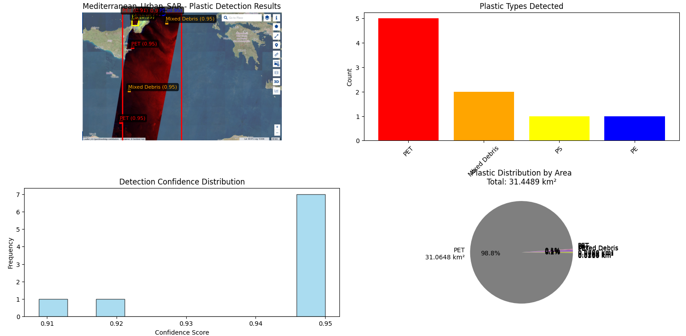
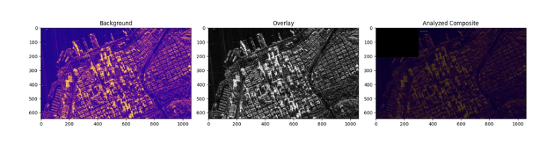

# Orbital Microplastic Monitoring System

Dual 6U CubeSat concept for finding marine microplastic hotspots from orbit, plus a ground prototype that runs the sensing idea on real Sentinel-1/2 satellite imagery. RVCE Experiential Learning project (CV242TA), 2024-25, with Sanskar Verma, Sarthak Sharma, and Shambhavi Shukla. Guide: Dr. A R Vinod.

Full report: [`Report/Environment_EL.pdf`](Report/Environment_EL.pdf) (LaTeX source in [`Report/Environment EL/`](Report/Environment%20EL/)). Portfolio write-up: [aboutkvs.vercel.app/cubesat.html](https://aboutkvs.vercel.app/cubesat.html).

## Why this exists

Ships can't map five trillion floating plastic particles across the ocean. Satellites already fly SAR and hyperspectral instruments that see the sea surface at scale. This project is the space-based case: one CubeSat flags where the water looks anomalous on radar, a second CubeSat looks closer at those coordinates in a spectral band where plastics actually show up.

## Mission architecture (concept, not flown)

| | |
|---|---|
| Orbit | Sun-synchronous, 500-550 km, in-track spacing 100-300 km |
| CubeSat 1 (SAR) | 6U, X-band SAR at 9.6 GHz, ~100-200 MHz bandwidth, stripmap, ~10-15 m resolution, ~30 km swath. Detects sea-surface anomalies via Mean Square Slope (MSS) drop vs a Hwang spectrum LUT. |
| CubeSat 2 (HSI) | 6U, VNIR CCD (400-1000 nm) + SWIR InGaAs (1000-2500 nm). Target bands: PET 1610 nm, PE 1730 nm, PP 2300 nm. ~30-50 m/pixel, 3-5 km swath. |
| Onboard SAR chain | Zynq-7020: range compression, Doppler azimuth compression, GPS/IMU motion compensation → 500x500 backscatter patch → 2D FFT to S(k) → compare against LUT, flag if MSS drops more than 15%. |
| Inter-satellite link | S-band, 2.2 GHz microstrip patch, 1 W, 8 dBi each end, 200 km design range. Link budget: FSPL 145.32 dB, received -101.32 dBm, margin 8.68 dB against a -110 dBm threshold. |
| Downlink | X-band, 10-20 Mbps, 4-6 passes/day, ~30-60 MB/day |

The S-band patch is sized in closed form on RT/Duroid 6006 (εr = 6.0, h = 3.2 mm) for a 2 GHz reference design (W = 40.09 mm, L = 29.8 mm), then re-tuned to the actual 2.2 GHz ISL frequency (53.90 x 45.32 mm on a thinner 1.6 mm, εr = 2.2 stack) and cross-checked in HFSS. The X-band SAR patch at 9.6 GHz comes out to 12.35 x 9.53 mm. Antenna sizing detail is in the report; only figures and the summary numbers are reproduced here.

## What's actually in this repo

**Report:** the full write-up (`Report/Environment_EL.pdf`) with the mission architecture, link budget, antenna design, and the ground-prototype results below.

**Ground prototype — plastic detection ([`Plastic Detection Code/1.py`](Plastic%20Detection%20Code/1.py)):** `SatellitePlasticDetector` loads a satellite image, computes three spectral indices (Plastic Index, NDPI, Floating Debris Index), thresholds the top 15% of the index, finds connected components with OpenCV, and draws bounding boxes.

**Important:** the polymer type label (PET/PE/PP/PS/mixed) it assigns per patch is `random.choice(self.plastic_types)`, not a trained classifier. This is a prototype for the detection *pipeline* (index → threshold → connected components → bounding box), not a working spectral classifier. Treat the boxes as "the index fired here," not as a laboratory-grade polymer ID. A flown mission would replace this step with an onboard classifier trained on real VNIR/SWIR cubes, which is what the architecture section of the report specifies.

**Sentinel-1/2 scenes used as test inputs:** three basins — South China Sea (Fujian coast, industrial dumping signal, 28 Jan 2023), the Norwegian Sea off Bergen, and the central Mediterranean between Sicily and Greece. Images live at repo root and in `Plastic Detection Code/` (several are duplicated under inconsistent/misspelled filenames from manual downloads, e.g. `sentinel 1 near norway.jpg` vs `norway_sar_s1.jpg` — same content, not cleaned up).

## What's described in the report but not in this repo

The report and the portfolio page both describe a second Python tool: an image-fusion script that blends the SAR background with an optical overlay (ORB feature matching + brute-force matcher, Laplacian variance for noise, Canny edges) to produce the composite in `docs/images/image_fusion.png`. That script is not present in this repository, only its output figure is (via the LaTeX report's image folder). If you're looking for the fusion code, it isn't checked in here.

## Running the detector

```bash
pip install numpy matplotlib pillow opencv-python scikit-learn pandas seaborn
cd "Plastic Detection Code"
python 1.py
```

Update the `regions` dict in `main()` with your own image filenames if you're not using the bundled Sentinel scenes. Runs in "dummy image" fallback mode if a file isn't found, so it won't crash without real inputs, it just detects on synthetic noise instead.

## Results (from the report)


*Norway coast, Sentinel-1 SAR scene used as SAR input.*


*Central Mediterranean, Sentinel-2 SWIR strip.*


*Mediterranean urban SAR scene — this case ended up tagging most of the strip as one large detection (31.45 km²), which is a limitation of the fixed-percentile threshold, not an actual 31 km² slick.*


*Output of the (not included) fusion script on the South China Sea pair: 356 matched keypoints, Laplacian variance 1298.89.*

## Limitations

- This is a paper concept plus a ground-side algorithm prototype, not a flown or even bench-tested spacecraft.
- Polymer classification is randomized, not learned — see above.
- The connected-components threshold (top 15% of the index) over-detects on high-contrast SAR scenes (urban coastline case above).
- Antenna designs are closed-form + HFSS simulation, not fabricated/measured hardware.
- The repo has duplicate, inconsistently named copies of the same source images scattered across the root, `Plastic Detection Code/`, and `Report/Environment EL/images/`; worth a manual cleanup pass if this repo grows further.

## Authors

Sanskar Verma, Sarthak Sharma, Shambhavi Shukla, Shanthosh K V — RVCE, Experiential Learning (CV242TA). Guide: Dr. A R Vinod.
